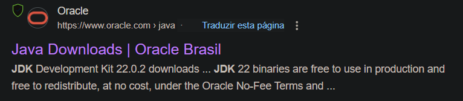
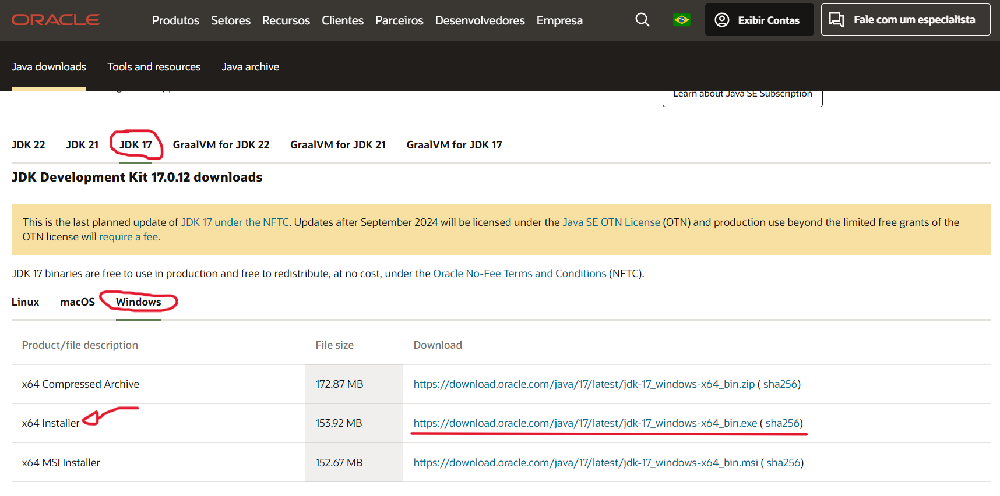
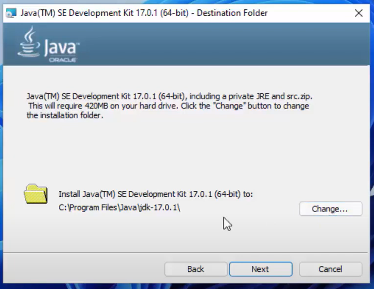
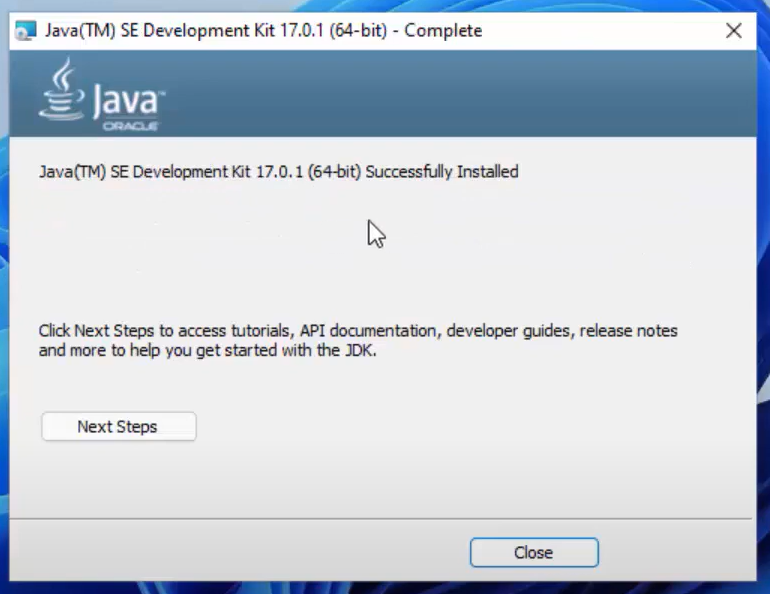
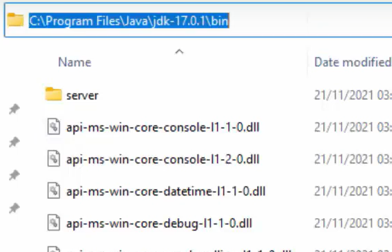
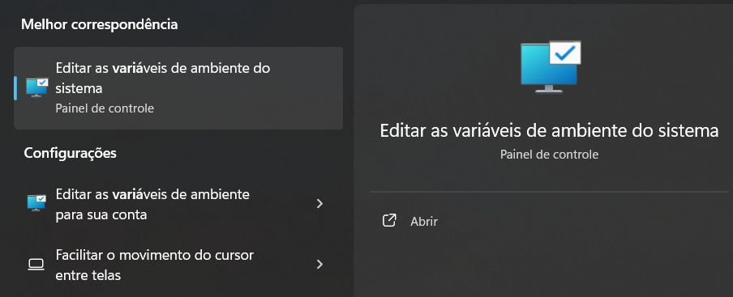
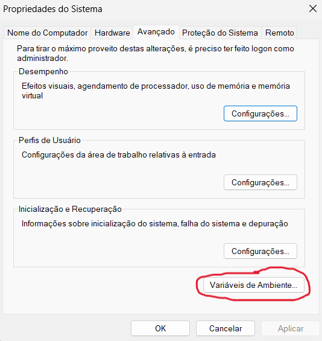
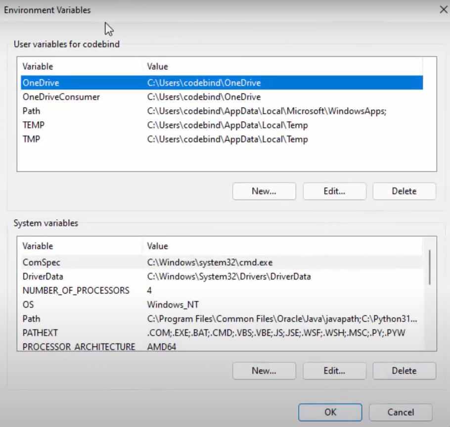
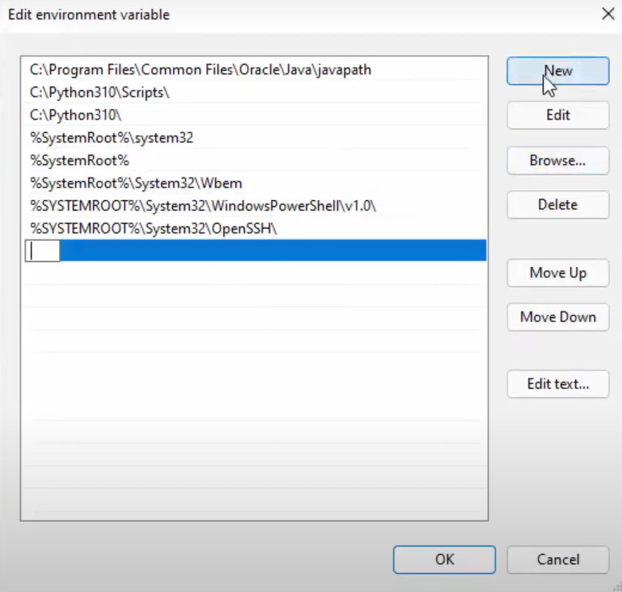
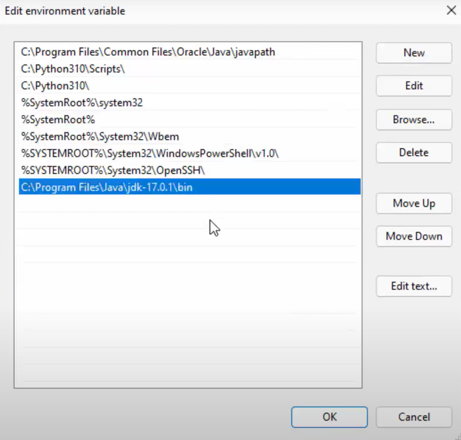

# 💻 Como Baixar os compiladores de C/C++ e Java na sua maquina:

Para conseguir baixar os compiladores das linguagens C/C++, primeiramente, é importante saber que a forma como isso é feito nos Sistemas Operacionais Linux e Windows difere bastante.

Equanto no Linux é necessário apenas executar alguns comandos rápidos, no Windows o processo é mais complicado.

Caso você ainda não tenha configurado o Linux na sua máquina, sugiro que se encaminhe para o diretório no qual lhe ensinarei três formas diferentes para fazer isso ([Linux]([AEDs-II/Linux](https://github.com/cestpassion/AEDs-II/tree/main/Linux)))

 

## ➡️ Como baixar o compilador de C/C++, GCC (GNU Compiler Collection), no Linux (Ubuntu/Debian):

* Para instalar:

>     sudo apt install build-essential

* Para verificar a instalação:

    * C:
        >     gcc --version
    * C++:
        >     g++ --version

 

### Sobre o GCC:

GCC é uma ferramenta essencial no desenvolvimento de software para Linux. Ele é usado não só para compilar programas simples, mas também para compilar grandes projetos, bibliotecas, e até mesmo o kernel Linux. Além disso, o GCC é conhecido por sua robustez e por seguir de perto os padrões das linguagens que suporta.

##

 

## ➡️ Como baixar o compilador de Java,  JDK-17 (Java Development Kit, versão 17), no Linux (Ubuntu/Debian):

* Para instalar:

>     sudo apt install openjdk-17-jdk

* Para verificar a instalação:

>     java -version
>     javac -version

 

### Sobre o JDK-17:

O JDK 17 é a versão 17 do Java Development Kit, que foi lançada em setembro de 2021 como uma versão de Suporte de Longo Prazo (LTS). O JDK é um conjunto completo de ferramentas que você precisa para desenvolver, compilar, depurar e executar aplicações Java.

##

 

## ➡️ Como baixar o compilador de C/C++, MinGW (Minimalist GNU for Windows), no Windows:

Tutorial disponivel no repositório de [AEDs-I](...)

##

 

## ➡️ Como baixar o compilador de Java,  JDK-17 (Java Development Kit, versão 17), no Windows:

#### 1) Acesse o Site do Oracle: [https://www.oracle.com/br/java/technologies/downloads/](https://www.oracle.com/br/java/technologies/downloads/)

 

#### 2) Selecione a opção "JDK 17", em seguida a opção "Windows" e o arquivo .exe "64x Installer:

 

#### 3) Next:

 

#### 4) Close:

 

#### 5) Configurando as Variáveis de Sistema no PATH:
   * Encontre a pasta "bin" dentro do diretório Java e copie seu caminho:

   
     

   * Na área de pesquisa do Windows localizada na Barra de Tarefas digite: "Variáveis de Sistema" e abra:

   
     

   * Selecione a opção "Variáveis de Ambiente":

   
     

   * Após os passos anteriores, você irá colar o caminho da pasta "bin" no PATH da variáveis de usuário e da variáveis de sistema:

   
     

   * Clique duas vezes na variável PATH e selecione "New":
   
   
     
    
   * Cole o caminho da pasta "bin":
     
   
     

   * Após esses passos aperte "ok" e aplique as mudanças.

 

#### 6) Para verificar se o complilador está cofigurado, entre no cmd e digite:

>     java -version
>     javac -version

### ❗Extra: Caso aconteca do compilador não funcionar mesmo após esses passos, volte nas variáveis de ambiente, selecione o caminho da pasta bin dentro do PATH e mova para cima.
